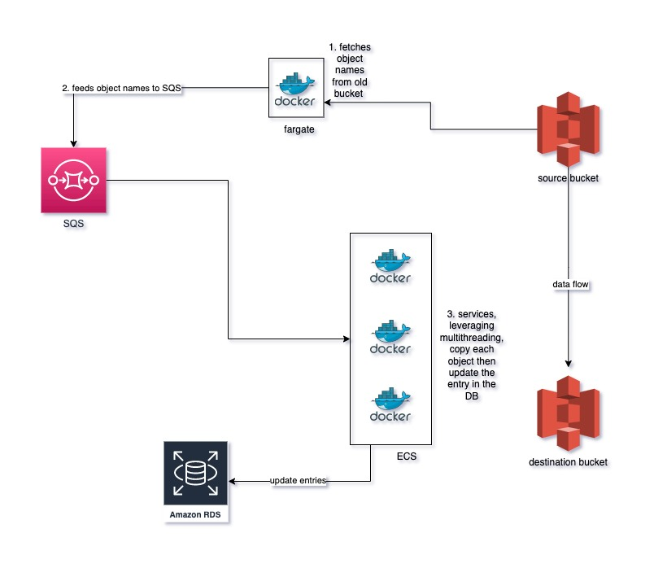

## Installation
This assumes that you have: 
- a source and destination bucket created on s3
- a remote postgres DB
- executed [the SQL script](https://drive.google.com/file/d/1DC46CHhtYLZ5lm3V174aGz9zf5_4mq5g/view?usp=sharing) on the remote db and run the 
[seeding script](https://drive.google.com/file/d/1VLlhFh2xDQJJ0pPH-usOaBlj5Vkxw_hv/view?usp=sharing) to insert data into the source bucket 
- created AWS user account credentials with s3 (read, write, copy) and SQS (read, write, delete) permissions
- created an SQS standard queue

## Steps
* clone the repository.
* `cd` into the `feeder` directory. create a `.env` file using the `env.sample` file as a reference.
* `cd` into the `consumer` directory. create a `.env` file using the `env.sample` file as a reference.
* cd to the root directory and run `docker-compose up`

[PS: docker and docker-compose must be installed on machine]

## Comments and considerations
For an ideal solution in a production environment, the feeder service would be running on a serverless 
containerization service like AWS fargate (Docker compose is used here for easy demonstration/setup locally). 
This enables it to run continuously and auto-scale without us having to
think of servers. 
The feeder service would feed the keys to the SQS (standard) queue which stores them until they are consumed by a worker
(consumer service). 
The consumer service would **ideally** be deployed to a container orchestration service like AWS ECS, with an 
autoscaling policy setup that allows several instances (as many as needed) of the container to run and process the
messages from the queue, while scaling up and down as needed. The idea here is to have several workers processing the
messages so the overall execution is much faster. Each worker updates the path of the image in the DB on every successful
copy to s3 - production flow is not disrupted.
In the event of a failure to copy an object, the key (message) doesn't get deleted from the SQS queue, and it would
automatically get processed/consumed again (either by the same worker or another worker) after the visibility timeout 
has expired.   

## Architecture

## Stack
* Go
* Docker

